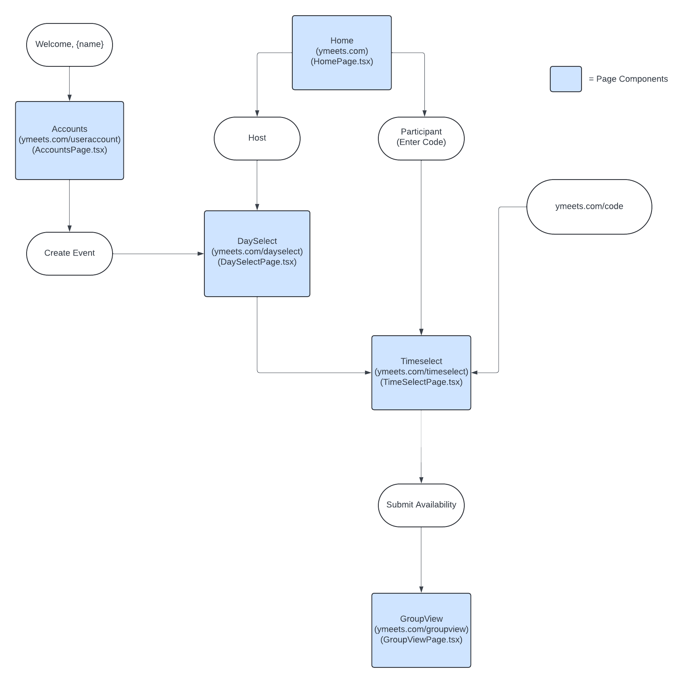
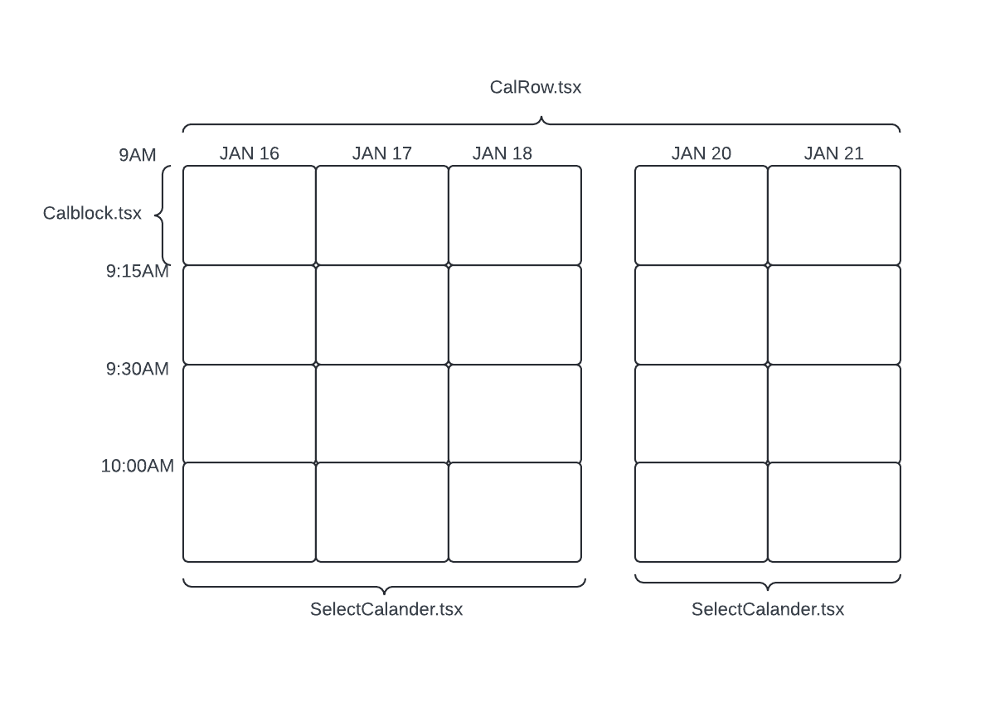

# ymeets - Yale Group Meetings Made Easy
ymeets provides a clean interface for scheduling meetings with other people. We aim to make the platform the go-to place for Yalies to plan their organized gatherings, with features ranging from GAPI integration to Yale Academic Calandar support. 

ymeets is an open-source application maintained by a team of volunteers within the [Yale Computer
Society](https://github.com/YaleComputerSociety), a tech organization at Yale University.

# Quick Start
`git clone` the repository.

Run `npm install`

Run `npm start` in the top level directory.

The currently deployed version can be viewed at https://ymeets.com.

# Contribution Guide
First, read this ReadMe in its entirety (you're off to a good start). Generally, people who contribute are part of the y/cs. If you have a contribution you want to make, but you are not part of the ymeets team within the y/cs, we welcome you to open a Pull Request. You can either solve an open issue that has not been assigned to someone, or contribute a new feature of your design. A successfully merged PR of significant contribution will earn you   implicit membership in the org. You will be credited on the site. 

If you wish to design your own feature, we encourage you to reach out to the ymeets team first at *yalecomputersociety@gmail.com*, as we reserve the right to reject any contributions we are not consulted on.

# Directory Structure
`src\components`:
Houses all of the dynamic and static frontend components.

There are three types of components: **Page Components**, **Page Support Components** and **Utility Components**. One should create components that all into one of these three categories, otherwise it likely need not be a component. 

Page components render at a specific route in `Root.tsx`. (i.e. the `AboutUs.tsx` component)

Page Support Components provide utility to support a *specific* page component. (i.e. the `ContributerCard()` function in `AboutUs.tsx`)

Utility Components are the building blocks to all other components. Examples of this are are general purpose buttons and input fields, found in the `utils/components` folder.

`src\firebase`:
Houses all the backend functionality. Backend is done via Firebase calls. Stay tuned for more backend documentation.

`src\static`:
Static imagery used across the site.

`Root.tsx`:
The react router, which handles page specific renderings.

`types.ts`: Types used across the front and backend of the application to saturate components. Types that are used with a handful of components are not defined here, but instead in their respective file.

As is expanded on in the style guide, other directory modules follow specific formats to make their functionality obvious.

# Page Hierachy, Visualzed 




# Architecture Notes
Specific details about the functionality of certain modules is kept inline in commons and jsdocs. This is meant to provide a high level overview of how the codebase works.

"Hosts" are people that create the "Event". Events are the object with information about the created **ymeet**. The word "Event" and "ymeet" are interchangeable in the codebase. The `EventDetails` object contains infomation about participants in the Event, the dimensions of the availability calander, and the selected times each person was available. This is done via index. Actual infromation about the people participating in the event is contained with the `Participant` object. This includes information like the location they voted for, their name, email (if logged in), etc. Backend and Frontend types are linked in the `eventAPI.ts` file.

`EventDetails` is converted into into two types frontend: `CalendarDimensions` and `CalendarState`. The first is merely the dimensions of the calender: column-wise are which days are availale to select, while row-wise is the times that one can choose from. The `CalendarApp` page support component renders a set of `SelectCalendar`s. This object is rendered row-wise, where each row is made up of a set of `CalBlock`s. Again, all of these are managed at the top-level by the `CalanderFramework` object that is fetched at the beginning of the render process and saturated wit hthe `CalendarDimensions` type.  `CalendarApp` is adapted by various circumstances depending on which page it is needed on. It is a do-it-all component, allowing the user to both view the availabilities of the group or edited their own based on the context.

The `CalendarState` object allows the frontend to consume information about who is available when relative to the `CalanderDimensions`. It is a 3D grid, where the first dimesnion specifies which user's availability to pluck out, and the other two dimensions specify the day and time you wish to change. 

Most of the logic for rendering in availability information (coloring certain blocks)
is done at the `CalBlock` level in an observer pattern.

Here is a quick visual overview:



# ymeets Style Guide
ymeets should be written in TypeScript.

General functions that are used across more than one file should be stored in the `\utils` folder under the `\functions` folder rather than be redeclared in each scope they are necessary. Components that are used as the building blocks for other larger components should be stored in the `\utils` folder under `\components`.

Component files should be declared in PascalCase, with a matching PascalCase function definition. Folders that do not contain an exported component file should be declared in camelCase. Please do not use class components under any circumstances.

At the top of each function, please include a brief docstring explaining what the function does.

# Firebase Cloud Functions

The `functions/` directory contains Firebase Cloud Functions (e.g., for sending emails via Resend).

## Setup

```bash
cd functions
npm install
```

## Development

Build the functions:
```bash
npm run build
```

Run the Firebase emulator locally:
```bash
npm run serve
```

## Deployment

Deploy functions to Firebase:
```bash
npm run deploy
```

Or from the root directory:
```bash
firebase deploy --only functions
```

## Notes

- The `functions/node_modules` directory is gitignored. Always run `npm install` in the `functions/` directory after cloning.
- Functions require Node 22. Ensure you're using the correct version (e.g., via `nvm use 22`).
- Secrets (like `RESEND_API_KEY`) are managed via Firebase and not stored in the repo.


